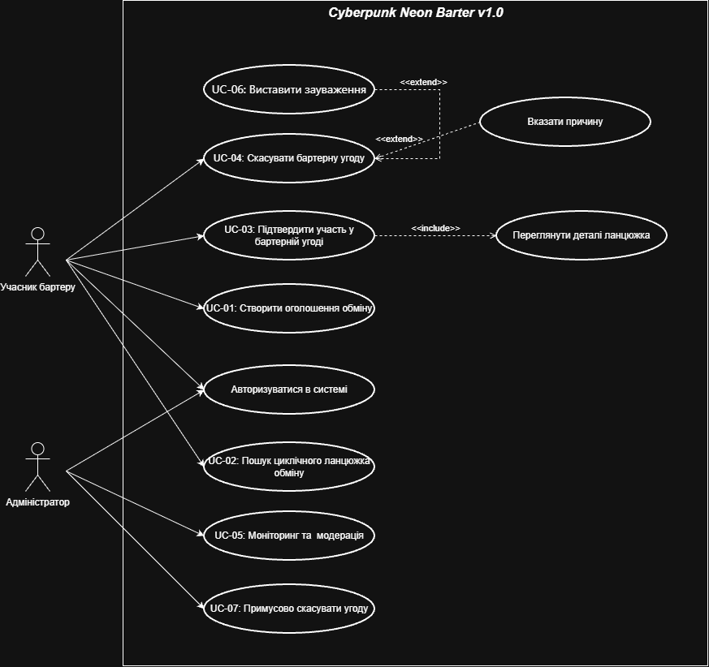
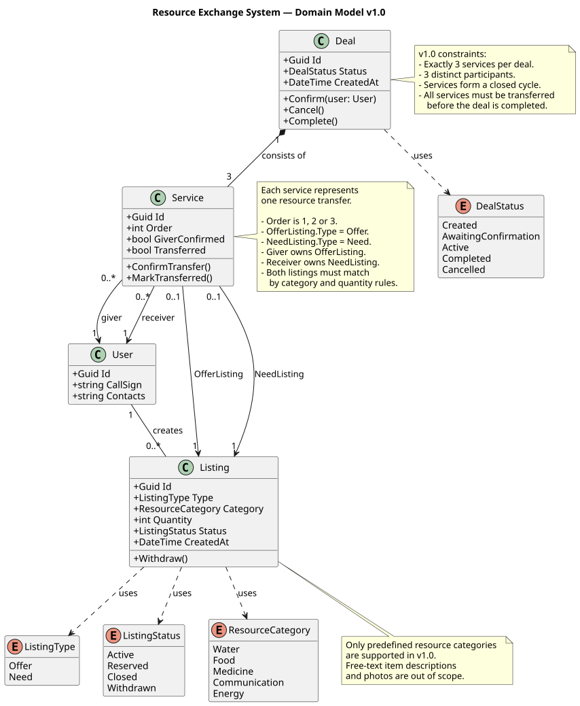

# Архітектурне проектування та UML-моделі (System Design)

Цей документ містить повний набір UML-моделей для проекту **Cyberpunk Neon Barter v1.0**, розроблений командою відповідно до методології Waterfall.

---

## 1. Прецеденти використання (Use Case Diagram)

*Відповідальна: Каріна (Integrator)*

Загальна діаграма варіантів використання відображає основні сценарії взаємодії Учасника бартеру та Адміністратора з системою.

**Основні прецеденти:**

- **UC-01:** Створити оголошення про обмін
- **UC-02:** Пошук циклічного ланцюжка обміну
- **UC-03:** Підтвердити участь у бартерній угоді
- **UC-04:** Скасувати бартерну угоду
- **UC-05:** Моніторинг та модерація пропозицій
- **UC-06:** Виставити зауваження (розширює UC-04)
- **UC-07:** Примусово скасувати угоду (для Адміністратора)

---

## 2. Модель предметної області (Class Diagram)

*Відповідальний: Артем (Architect)*

Діаграма класів описує ключові сутності системи (`User`, `Listing`, `Deal`, `Service`, `DealStatus`, `ListingStatus`, `ListingType`, `ResourceCategory`), їхні атрибути, методи та зв'язки. Модель відображає предметну область v1.0, де угода (`Deal`) складається рівно з трьох послуг (`Service`), що утворюють замкнений цикл обміну, а оголошення (`Listing`) чітко класифікуються за типом та категорією ресурсу.

**Пояснення зв'язків:**

- `Deal (1) — (3) Service` — одна угода складається рівно з 3 послуг (кроків), що формують цикл.
- `User (1) — (*) Listing` — один користувач може створити багато оголошень.
- `Service (1) — (0..1) Listing` — кожен крок послуги посилається на одне оголошення (або `OfferListing`, або `NeedListing`).
- `Listing (1) — (1) ResourceCategory` — кожне оголошення належить до однієї з фіксованих категорій ресурсів.
- `User (1) — (*) Service` — користувач виступає в ролі `giver` або `receiver` для багатьох послуг.

## 3. Модель станів (State Machine Diagram)

*Відповідальна: Настя (QA / Reviewer)*

Діаграма станів описує життєвий цикл основної сутності — **`BarterDeal` (Бартерна угода)**.

**Опис переходів:**

| Перехід | Умова | Дія |
|---|---|---|
| `[*] → Created` | Алгоритм знайшов цикл довжиною ≥ 3 | Створення `BarterDeal`, логування |
| `Created → PendingConfirmations` | Автоматично після створення | Надсилання сповіщень |
| `PendingConfirmations → Active` | Усі учасники підтвердили | `ActivateDeal()` |
| `PendingConfirmations → Cancelled` | Відхилення або таймаут | `CancelDeal()`, повернення оголошень |
| `Active → Completed` | Усі сторони підтвердили обмін | Закриття угоди |
| `Active → Cancelled` | Примусове скасування адміном | `CancelDeal()`, логування |

---

## 4. Глосарій

| Термін | Опис |
|---|---|
| **Циклічний ланцюжок** | Замкнений ланцюг обміну A → B → C → A, де кожен учасник віддає один ресурс і отримує інший |
| **BarterDeal** | Сутність, що об'єднує учасників та їхні оголошення в один цикл обміну |
| **BarterParticipant** | Проміжна сутність, що зв'язує користувача, оголошення та угоду |
| **OfferStatus** | Статус оголошення: Active, InBarter, Deactivated, Closed |
| **DealStatus** | Статус угоди: Created, PendingConfirmations, Active, Completed, Cancelled |

---

## 5. Подієві сценарії дій (Activity Diagrams)

| UC | Файл | Відповідальний |
|---|---|---|
| UC-01 | [activity-uc-01.md](../model/activity-uc-01.md) | Ян (Analyst) |
| UC-02 | [activity-uc-02.md](../model/activity-uc-02.md) | Артем (Architect) |
| UC-03 | [activity-uc-03.md](../model/activity-uc-03.md) | Каріна (Integrator) |
| UC-04 | [activity-uc-04.md](../model/activity-uc-04.md) | Настя (QA) |
