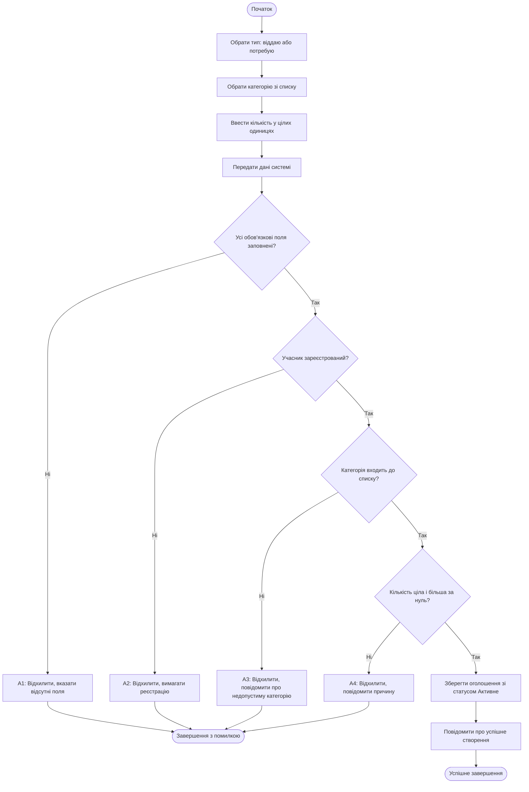

# Activity Diagram UC-01 «Створення оголошення обміну»

Діаграма відповідає на інженерне питання: як проходить сценарій створення оголошення і де виникають альтернативи. На ній видно основний шлях (кроки 1–10) та чотири відхилення A1–A4 із [специфікації UC-01](../docs/use-cases.md). Пов'язані вимоги: FR-02, FR-03, FR-04, FR-05, NFR-04.

