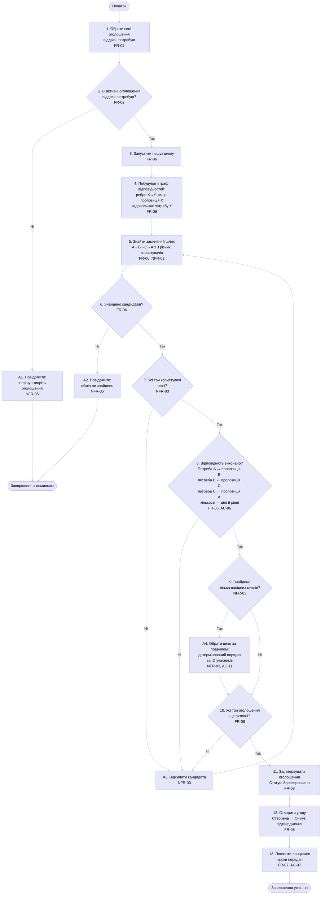

# Activity Diagram: UC-02 «Знайти циклічний ланцюжок обміну»

Діаграма відповідає на інженерне питання: як проходить сценарій пошуку 3-циклу A→B→C→A, створення угоди й альтернативні завершення. На ній видно основний шлях (кроки 1–13) та чотири відхилення A1–A4 із [специфікації UC-02](../docs/use-cases.md). Пов'язані вимоги: FR-02, FR-06, FR-07, FR-08, NFR-02, NFR-03, NFR-05, AC-06, AC-07, AC-11.

