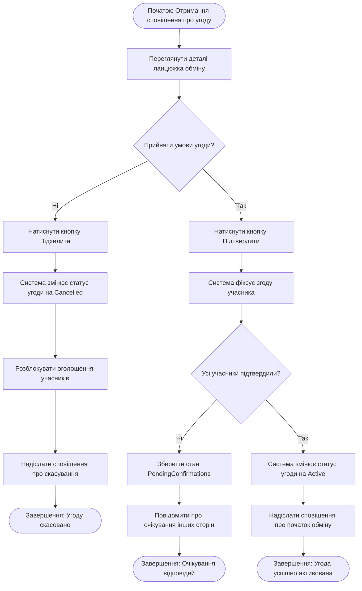

# Activity Diagram: UC-03 Підтвердити участь у бартерній угоді

```mermaid
flowchart TD
    A([Початок: Отримання сповіщення про угоду]) --> B[Переглянути деталі ланцюжка обміну]
    B --> C{Прийняти умови угоди?}

    %% Гілка відхилення
    C -- Ні --> D[Натиснути кнопку Відхилити]
    D --> E[Система змінює статус угоди на Cancelled]
    E --> F[Розблокувати оголошення учасників]
    F --> G[Надіслати сповіщення про скасування]
    G --> H([Завершення: Угоду скасовано])

    %% Гілка підтвердження
    C -- Так --> I[Натиснути кнопку Підтвердити]
    I --> J[Система фіксує згоду учасника]
    J --> K{Усі учасники підтвердили?}

    %% Очікування інших
    K -- Ні --> L[Зберегти стан PendingConfirmations]
    L --> M[Повідомити про очікування інших сторін]
    M --> N([Завершення: Очікування відповідей])

    %% Повна активація
    K -- Так --> O[Система змінює статус угоди на Active]
    O --> P[Надіслати сповіщення про початок обміну]
    P --> Q([Завершення: Угода успішно активована])
```