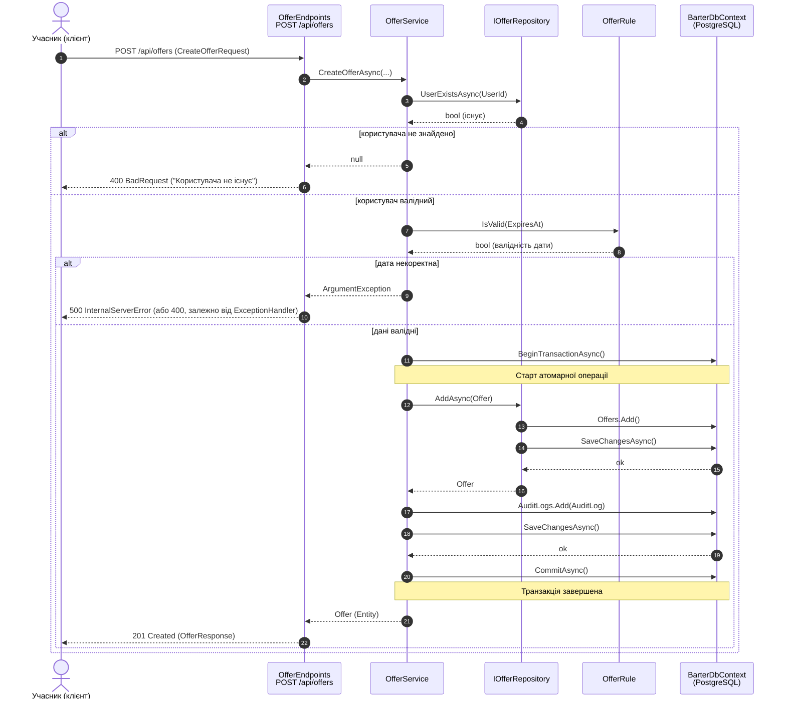

# Sequence Diagram — UC-01: Відображає новий потік через службу та правило під час створення оголошення

```mermaid
sequenceDiagram
    autonumber
    actor U as Учасник (клієнт)
    participant API as OfferEndpoints<br/>POST /api/offers
    participant Service as OfferService
    participant Repo as IOfferRepository
    participant Rule as OfferRule
    participant DB as BarterDbContext<br/>(PostgreSQL)

    U->>API: POST /api/offers (CreateOfferRequest)
    API->>Service: CreateOfferAsync(...)
    
    Service->>Repo: UserExistsAsync(UserId)
    Repo-->>Service: bool (існує)
    
    alt користувача не знайдено
        Service-->>API: null
        API-->>U: 400 BadRequest ("Користувача не існує")
    else користувач валідний
        Service->>Rule: IsValid(ExpiresAt)
        Rule-->>Service: bool (валідність дати)
        
        alt дата некоректна
            Service-->>API: ArgumentException
            API-->>U: 500 InternalServerError (або 400, залежно від ExceptionHandler)
        else дані валідні
            Service->>DB: BeginTransactionAsync()
            Note over Service, DB: Старт атомарної операції
            
            Service->>Repo: AddAsync(Offer)
            Repo->>DB: Offers.Add()
            Repo->>DB: SaveChangesAsync()
            DB-->>Repo: ok
            Repo-->>Service: Offer
            
            Service->>DB: AuditLogs.Add(AuditLog)
            Service->>DB: SaveChangesAsync()
            DB-->>Service: ok
            
            Service->>DB: CommitAsync()
            Note over Service, DB: Транзакція завершена
            
            Service-->>API: Offer (Entity)
            API-->>U: 201 Created (OfferResponse)
        end
    end
```